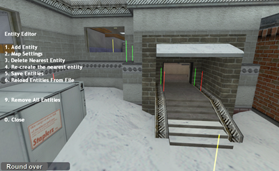

# Entity Menu System Documentation

## 1. Overview

The Entity Menu System is a powerful in-game tool that allows the server host to add, manage, and configure game entities on any map without needing to decompile or recompile the map itself. This allows for fine-tuning player spawns, item placement, and map-specific rules on the fly.

All changes are saved to a map-specific configuration file: `maps/<mapname>_ttt.txt`.

> **Note:** This menu is only accessible to the host on a listen server. It is not available on dedicated servers or for regular clients.

## 2. Accessing the Menu

The menu can be opened using console commands. While `ttt_ent_menu` opens the main menu, you can also use more specific commands to skip directly to a desired submenu.

### Available Commands

| Command                  | Description                                |
| ------------------------ | ------------------------------------------ |
| `ttt_ent_menu`           | Opens the main (root) entity menu.         |
| `ttt_ent_add`            | Opens the "Add Entity" submenu.            |
| `ttt_ent_map_settings`   | Opens the "Map Settings" submenu.          |
| `ttt_ent_add_item`       | Opens the "Item Spawner" submenu.          |
| `ttt_ent_add_standard`   | Opens the "Standard Weapons" item submenu. |
| `ttt_ent_add_ammo`       | Opens the "Ammo" item submenu.             |
| `ttt_ent_add_grenade`    | Opens the "Grenades" item submenu.         |
| `ttt_ent_add_detective`  | Opens the "Detective Items" submenu.       |
| `ttt_ent_add_traitor`    | Opens the "Traitor Items" submenu.         |

## 3. The Main Menu

The main menu provides the primary options for managing entities.

-   **Add Entity**: Opens a sub-menu for creating new entities and placing them in the world.
-   **Map Settings**: Configure rules for how custom entities interact with the map's default entities.
-   **Delete Nearest Entity**: Removes the custom entity marker closest to the player (within a 128-unit radius).
-   **Recreate Nearest Entity**: Recreates the nearest entity at the player's position.
-   **Save Entities**: Saves all current entity placements and map settings to the `maps/<mapname>_ttt.txt` file.
-   **Reload Entities From File**: Discards any unsaved changes and reloads all entities and settings from the configuration file.
-   **Remove All Entities**: Removes all custom entities from the map. This action must be saved to be made permanent.

## 4. Adding Entities

When an entity is added, it is placed on the ground directly beneath the player. A colored beam of light, or "marker," will appear to visualize where the entity will spawn when the map loads.

The color of the marker indicates the type of entity:
-   **Yellow**: Player Spawn (`ttt_playerspawn`)
-   **Red**: Weapon
-   **Green**: Ammo
-   **Blue**: Special Item (e.g., equipment)

### Add Entity Menu

This menu categorizes the different types of entities you can create.

-   **Spawnpoint**: Places a TTT player spawn marker. The spawn point will face the same direction as the player.
-   **Item Spawner**: Opens a sub-menu for placing specific weapons, ammo, and equipment.
-   **Random Weapon**: Places a `ttt_random_weapon` spawner, which will spawn a random weapon at that location each round.
-   **Random Ammo**: Places a `ttt_random_ammo` spawner, which will spawn a random ammo type at that location each round.

## 5. Map Settings

This menu allows you to control how the custom entities from your configuration file interact with the entities that are already part of the original map file.

-   **Replace Existing Spawns**: If set to `(On)`, the system will remove all default `info_player_deathmatch` entities from the map at startup before spawning the custom ones from your file.
-   **Replace Existing Weapons**: If set to `(On)`, the system will remove all default weapons and ammo from the map at startup before spawning the custom ones from your file.

> **Important**: For these settings to take effect, they must be saved via the "Save Entities" option and the map must be restarted.

## 6. The Entity Configuration File

The system uses a simple text file to store all entity and setting data, located at `maps/<mapname>_ttt.txt`. While it is recommended to use the in-game menu, this file can be manually edited.

The file format is straightforward:

-   **Settings**: Lines beginning with `setting:` define a key-value pair.
-   **Entities**: Other lines represent an entity with its classname, origin (X Y Z), and angles (Pitch Yaw Roll).
-   **Comments**: Lines beginning with `#` are ignored.
